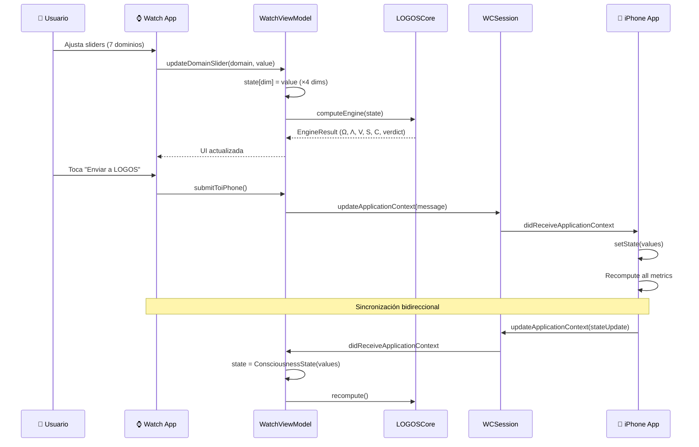

# ARQUITECTURA APPLE WATCH — LOGOS Companion App

> **Documento:** SRS-WATCH-001  
> **Estándar:** IEEE 830 / ISO/IEC/IEEE 42010  
> **Versión:** 3.2.0  
> **Autor:** Dr. José Manuel Cadena Ortiz de Montellano  
> **Framework:** Cadena Strategic Systems  
> **Fecha:** 2026-02-09

---

## Índice

1. [Visión General](#1-visión-general)
2. [Stack Tecnológico](#2-stack-tecnológico)
3. [Estructura de Archivos](#3-estructura-de-archivos)
4. [LOGOSCore Swift Package](#4-logoscore-swift-package)
5. [Vistas (SwiftUI)](#5-vistas-swiftui)
6. [WatchViewModel](#6-watchviewmodel)
7. [WatchConnectivity](#7-watchconnectivity)
8. [Complications (WidgetKit)](#8-complications-widgetkit)
9. [Flujo de Datos](#9-flujo-de-datos)
10. [Configuración de Signing](#10-configuración-de-signing)

---

## 1. Visión General

La app Apple Watch de LOGOS es un **companion app** que permite al usuario:

- **Ver métricas** en tiempo real (Ω, Λ, V, S, C) con anillo de progreso
- **Input rápido** de los 7 dominios vía sliders con Digital Crown
- **Enviar datos** al iPhone vía WatchConnectivity
- **Complicaciones** en la cara del reloj (Ω, Λ, veredicto)

**Plataforma:** watchOS 10+  
**Framework:** SwiftUI + WidgetKit  
**Comunicación:** WCSession (Application Context + Messages)

---

## 2. Stack Tecnológico

| Capa | Tecnología | Versión | Propósito |
|------|-----------|---------|----------|
| **UI** | SwiftUI | 5.0+ | Interfaz nativa watchOS |
| **Motor** | LOGOSCore (SPM) | 1.0 | Cómputo de métricas |
| **Comms** | WatchConnectivity | — | Sync iPhone ↔ Watch |
| **Widgets** | WidgetKit | — | Complicaciones en watch face |
| **Concurrencia** | Swift 6 Concurrency | — | @MainActor, nonisolated |
| **Persistencia** | UserDefaults | — | Estado local del Watch |

---

## 3. Estructura de Archivos

```
ios/App/LOGOSWatch Watch App/
├── LOGOSWatchApp.swift              # Entry point (@main)
├── ContentView.swift                 # Root view (TabView vertical, 3 pages)
├── WatchViewModel.swift              # State management + WCSession
├── Views/
│   ├── HomeView.swift                # Dashboard principal (Ω ring + metrics)
│   ├── EmergenceView.swift           # Emergence: ERS gauge + phase + landscape + domains
│   └── QuickInputView.swift          # Sliders por dominio
├── Complications/
│   └── ComplicationProvider.swift    # WidgetKit timeline provider
├── Assets.xcassets/
│   └── AppIcon.appiconset/           # App icon 1024x1024
└── Info.plist                        # Bundle config
```

---

## 4. LOGOSCore Swift Package

**Ubicación:** `ios/App/LOGOSCore/`  
**Tipo:** Local Swift Package  
**Propósito:** Motor de cómputo compartido entre iPhone y Watch

### Tipos Exportados

```swift
// ConsciousnessState — 28 dimensiones
struct ConsciousnessState: Codable {
    var values: [String: Double]  // key → value ∈ [0,1]
    
    subscript(dim: String) -> Double {
        get { values[dim] ?? 0.5 }
        set { values[dim] = newValue }
    }
    
    func domainAverage(_ domain: Domain) -> Double
}

// Domain — 7 dominios
enum Domain: String, CaseIterable {
    case physical, emotional, mental, spiritual, relational, purpose, alimento
    
    var dimensions: [String]  // 4 dimensiones por dominio
}

// EngineResult — Resultado del motor completo
struct EngineResult {
    let logos: LogosResult
    let omega: Double
    let viability: Double
    let entropy: Double
    let coherence: Double
    let freeEnergy: Double
    let trajectory: Double       // Q(x)
    let ers: Double              // Emergence Readiness Score
    let verdict: String
    let verdictColor: String     // hex color
    let verdictIcon: String
    let verdictReason: String
    let phase: String            // "Ordenada" | "Fluida" | "Gas"
}

// Función principal
func computeEngine(_ state: ConsciousnessState) -> EngineResult
```

### Cómputo

El motor Swift es una **reimplementación nativa** de `src/core/*.ts`, con las mismas fórmulas:

- `computeLogosAlignment()` → Λ(x)
- `computeViability()` → V(x)
- `computeEntropy()` → S(x)
- `computeCoherence()` → C(x)
- `computeFreeEnergy()` → F(x)
- `computeOmega()` → Ω(x)
- `computeTrajectory()` → Q(x)
- `computeERS()` → Emergence Readiness Score
- `computePolicy()` → π(x) inhibition policy
- `computePhase()` → Ginzburg-Landau phase classification

---

## 5. Vistas (SwiftUI)

### 5.1 ContentView.swift

Root view con TabView vertical (scroll entre vistas):

```swift
struct ContentView: View {
    @EnvironmentObject var viewModel: WatchViewModel

    var body: some View {
        TabView {
            HomeView()          // Page 1: Dashboard (Ω, Λ, V, S, C, ERS, Q)
            EmergenceView()     // Page 2: Emergence (ERS gauge, phase, landscape, domains)
            QuickInputView()    // Page 3: Input rápido (7 domain sliders)
        }
        .tabViewStyle(.verticalPage)
    }
}
```

### 5.2 HomeView.swift — Dashboard

| Elemento | Descripción |
|----------|-------------|
| **Título** | "ΛOGOS" en font light |
| **Anillo Ω** | Circle progress ring con color del veredicto |
| **Ω Value** | Valor numérico centrado en el anillo |
| **Verdict pill** | Capsule con texto del veredicto y color |
| **Λ, V pills** | MetricPill horizontal |
| **S, C pills** | MetricPill horizontal (S inverted) |
| **Sync status** | Tiempo relativo desde última sincronización |

**MetricPill colores:**
- ≥ 0.65 → Verde
- ≥ 0.45 → Amarillo
- ≥ 0.25 → Naranja
- < 0.25 → Rojo

### 5.3 EmergenceView.swift — Pantalla de Emergencia (v5.0)

Pantalla dedicada a las métricas de emergence del modelo, optimizada para watch:

| Componente | Descripción |
|------------|-------------|
| **ERS Gauge** | Anillo circular con gradiente angular, valor centrado (0-100%) |
| **Phase Badge** | Indicador de fase Ginzburg-Landau (Ordenada/Fluida/Gas) con descripción |
| **Energy Landscape Mini** | Minimap 2D: X=Λ, Y=S, punto dorado del usuario, A⁺/A⁻ atractores |
| **Domain Bars** | 7 barras horizontales de progreso por dominio (Multi-Scale Λ) |
| **Attractor Indicator** | Convergencia a A⁺ o A⁻ con mensaje contextual |

**Colores de fase:**
- Ordenada (Λ > 0.65) → Verde `#10B981`
- Fluida (0.35 < Λ < 0.65) → Amarillo `#F59E0B`
- Gas (Λ < 0.35) → Rojo `#EF4444`

**Mensajes del atractor:**
- Λ > 0.65, S < 0.30 → "Convergencia a A⁺ — auto-organización activa"
- Λ > 0.50 → "Tendencia hacia A⁺ — mantén prácticas"
- Λ > 0.35 → "Zona de transición — incrementa alineación"
- Λ < 0.35 → "Cerca de A⁻ — reconecta con el Logos"

### 5.4 QuickInputView.swift — Input Rápido

7 dominios con sliders (0-100%, step 0.05):

| Dominio | Icono | Color |
|---------|-------|-------|
| Cuerpo | ◈ | #10B981 |
| Emociones | ◇ | #F59E0B |
| Mente | ⟐ | #6366F1 |
| Espíritu | ✦ | #A855F7 |
| Relaciones | ⬡ | #EC4899 |
| Propósito | ◎ | #0EA5E9 |
| Alimento | ⚘ | #84CC16 |

**Botón "Enviar a LOGOS":** Envía valores al iPhone vía WCSession.

---

## 6. WatchViewModel

**Archivo:** `WatchViewModel.swift`  
**Tipo:** ObservableObject + WCSessionDelegate  
**Anotación:** @MainActor

### Estado Publicado

```swift
@Published var state = ConsciousnessState()
@Published var engineResult: EngineResult?
@Published var isConnected = false
@Published var lastSync: Date?
@Published var domainValues: [Domain: Double]  // Para sliders
```

### Funciones Principales

| Función | Descripción |
|---------|-------------|
| `recompute()` | Ejecuta `computeEngine(state)` y actualiza `engineResult` |
| `updateDomainSlider(domain, value)` | Actualiza 4 dimensiones del dominio + recompute |
| `submitToiPhone()` | Envía estado vía `WCSession.updateApplicationContext()` |
| `loadLocalState()` | Restaura estado desde UserDefaults |
| `saveStateLocally()` | Persiste estado en UserDefaults |

### WCSession Delegate (nonisolated)

```swift
extension WatchViewModel: WCSessionDelegate {
    nonisolated func session(_:, activationDidCompleteWith:, error:)
    nonisolated func session(_:, didReceiveApplicationContext:)
    nonisolated func session(_:, didReceiveMessage:)
}
```

Todos los callbacks usan `Task { @MainActor in ... }` para thread safety (Swift 6).

---

## 7. WatchConnectivity

### Protocolo de Comunicación

| Dirección | Método | Contenido | Uso |
|-----------|--------|-----------|-----|
| **Watch → iPhone** | `updateApplicationContext()` | `{ type: "dimensionUpdate", values: {...}, timestamp }` | Input rápido |
| **iPhone → Watch** | `updateApplicationContext()` | `{ type: "stateUpdate", ... }` | Sincronización de estado |
| **Bidireccional** | `sendMessage()` | Tiempo real si reachable | Actualizaciones inmediatas |

### Formato de Mensaje

```json
{
  "type": "dimensionUpdate",
  "values": {
    "sleep": 0.65, "nutrition": 0.70, "exercise": 0.50, "energy": 0.60,
    "peace": 0.55, "gratitude": 0.65, "love": 0.70, "joy": 0.60,
    "clarity": 0.50, "focus": 0.55, "creativity": 0.45, "wisdom": 0.60,
    "faith": 0.70, "meditation": 0.40, "service": 0.50, "presence": 0.65,
    "family": 0.75, "friendship": 0.55, "community": 0.45, "compassion": 0.60,
    "meaning": 0.65, "mission": 0.55, "contribution": 0.50, "legacy": 0.40,
    "nourishment": 0.60, "taste_presence": 0.50, "food_harmony": 0.55, "gut_resonance": 0.50
  },
  "timestamp": "2026-02-09T12:00:00Z"
}
```

### Fallback

Si WCSession no está reachable, el Watch:
1. Guarda estado localmente (`UserDefaults`)
2. Intenta reenviar en la próxima activación
3. El motor local computa métricas independientemente

---

## 8. Complications (WidgetKit)

### ComplicationProvider.swift

**Tipo:** TimelineProvider (WidgetKit, migrado de ClockKit)  
**Actualización:** Cada 15 minutos

### Timeline Entry

```swift
struct LOGOSEntry: TimelineEntry {
    let date: Date
    let omega: Double    // Ω ∈ [0,1]
    let lambda: Double   // Λ ∈ [0,1]
    let verdict: String  // "ACTÚA", "MONITOREA", etc.
    let verdictHex: String  // Color hex
}
```

### Generación de Timeline

```swift
func getTimeline(in context: Context, completion: @escaping (Timeline<LOGOSEntry>) -> Void) {
    let entry = currentEntry()   // Lee estado local → computa motor
    let nextUpdate = Calendar.current.date(byAdding: .minute, value: 15, to: Date())!
    let timeline = Timeline(entries: [entry], policy: .after(nextUpdate))
    completion(timeline)
}
```

### Familias de Complicaciones Soportadas

| Familia | Contenido |
|---------|-----------|
| **Circular** | Ω con anillo de progreso |
| **Rectangular** | Ω + Λ + veredicto |
| **Inline** | "Ω: 65% ACTÚA" |

---

## 9. Flujo de Datos



---

## 10. Configuración de Signing

| Parámetro | Valor |
|-----------|-------|
| **Bundle ID (iOS)** | `com.cadenastrategic.logos` |
| **Bundle ID (Watch)** | `com.cadenastrategic.logos.watchkitapp` |
| **Team ID** | `N9GCJN5F6S` |
| **Signing Identity** | Apple Development: Manuel Cadena (NAJMCJYR6R) |
| **Code Sign Style** | Automatic |
| **Deployment Target (iOS)** | 17.0 |
| **Deployment Target (watchOS)** | 10.0 |
| **Swift Version** | 5.9+ (Swift 6 concurrency) |

### Archive Command

```bash
xcodebuild -project ios/App/App.xcodeproj \
  -scheme "App" \
  -destination 'generic/platform=iOS' \
  -configuration Release \
  -archivePath /tmp/LOGOS.xcarchive \
  archive \
  DEVELOPMENT_TEAM=N9GCJN5F6S \
  CODE_SIGN_STYLE=Automatic
```

### Background Tasks

```xml
<!-- Info.plist -->
<key>BGTaskSchedulerPermittedIdentifiers</key>
<array>
    <string>com.cadenastrategic.logos.healthsync</string>
</array>
```

---

## Referencias Cruzadas

- [HEALTHKIT_BRIDGE.md](./HEALTHKIT_BRIDGE.md) — Pipeline de datos biométricos
- [BIOMETRIC_FEEDBACK_LOOP.md](./BIOMETRIC_FEEDBACK_LOOP.md) — Integración con motor core
- [INSTRUCTIVO_XCODE_iOS_WATCH.md](./INSTRUCTIVO_XCODE_iOS_WATCH.md) — Paso a paso Xcode
- [PLAN_LOGOS_iOS_APPLE_WATCH.md](./PLAN_LOGOS_iOS_APPLE_WATCH.md) — Plan de implementación
