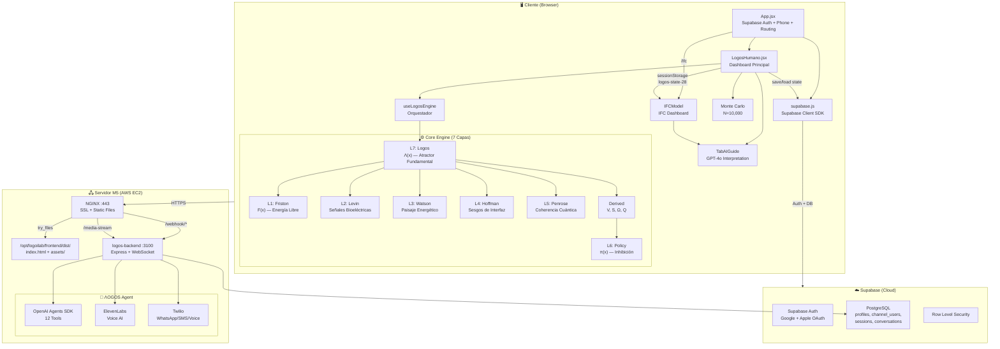
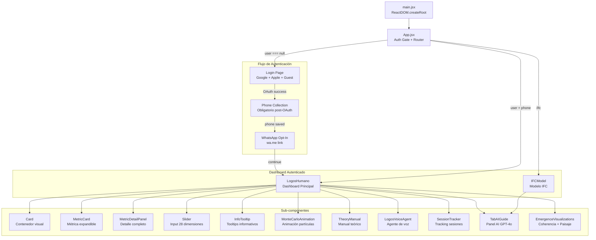
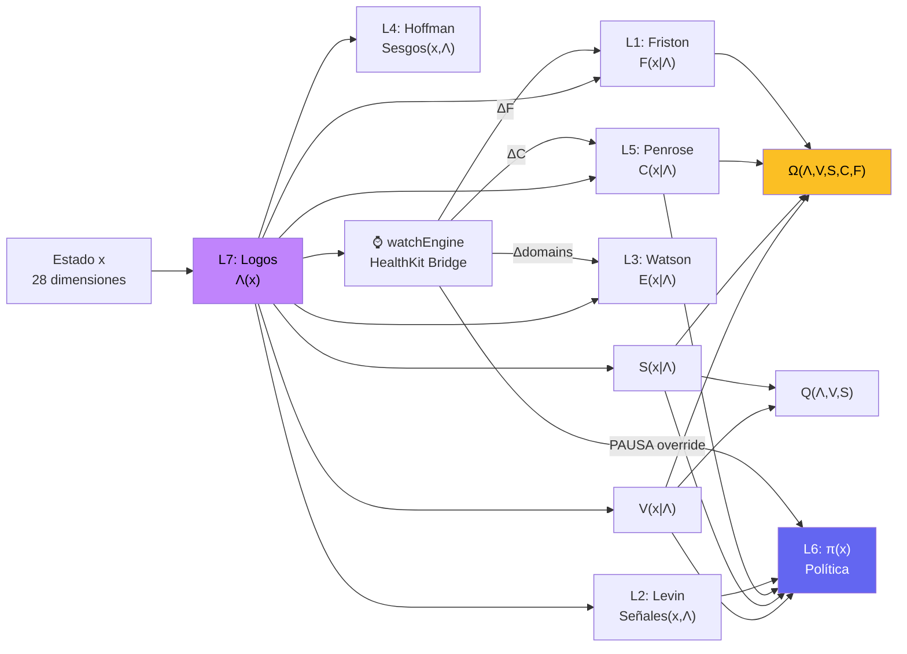
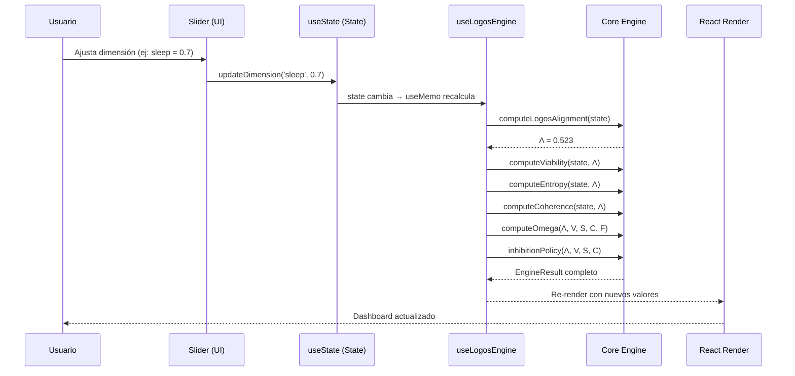
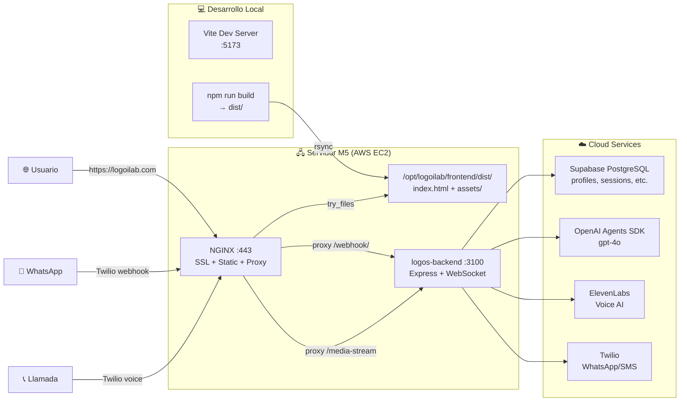

# ARQUITECTURA DEL SISTEMA LOGOS

> **Documento:** SRS-ARCH-001  
> **Estándar:** IEEE 830 / ISO/IEC/IEEE 42010  
> **Versión:** 3.3.0  
> **Autor:** Dr. José Manuel Cadena Ortiz de Montellano  
> **Framework:** Cadena Strategic Systems  
> **Fecha:** 2026-02-09

---

## Índice

1. [Visión General](#1-visión-general)
2. [Stack Tecnológico](#2-stack-tecnológico)
3. [Patrón Arquitectónico](#3-patrón-arquitectónico)
4. [Diagrama de Arquitectura](#4-diagrama-de-arquitectura)
5. [Estructura de Directorios](#5-estructura-de-directorios)
6. [Diagrama de Componentes React](#6-diagrama-de-componentes-react)
7. [Pipeline de Computación (7 Capas)](#7-pipeline-de-computación-7-capas)
8. [Flujo de Datos Unidireccional](#8-flujo-de-datos-unidireccional)
9. [Dependencias Externas](#9-dependencias-externas)
10. [Infraestructura de Despliegue](#10-infraestructura-de-despliegue)

---

## 1. Visión General

LOGOS es un **Sistema Operativo de Consciencia** que modela matemáticamente el estado integral de un ser humano a través de **28 dimensiones** agrupadas en **7 dominios de vida** (Physical, Emotional, Mental, Spiritual, Relational, Purpose, Alimento Sagrado), procesadas por un motor de cómputo de **7 capas** fundamentado en 5 marcos científicos de clase mundial, con integración biométrica cerrada vía Apple Watch + HealthKit, **20 paneles de interpretación AI** (GPT-4o) en cada pestaña, y un **bridge IFC ↔ LOGOS** que hereda el estado de 28 dimensiones al modelo de control inhibitorio.

El sistema implementa un modelo de atractores duales:
- **A⁺** (Atractor Positivo): Convergencia hacia el Logos — alineación, coherencia, viabilidad.
- **A⁻** (Atractor Negativo): Espiral entrópica — desconexión, caos, colapso.

---

## 2. Stack Tecnológico

| Capa | Tecnología | Versión | Propósito |
|------|-----------|---------|----------|
| **Runtime** | Node.js | 18+ | Entorno de ejecución |
| **Build** | Vite | 5.4.x | Bundler y dev server |
| **UI Framework** | React | 18.3.x | Interfaz de usuario reactiva |
| **Lenguaje** | TypeScript / JSX | 5.3.x | Tipado estático (core) + JSX (UI) |
| **Routing** | React Router DOM | 7.13.x | Navegación SPA |
| **Visualización** | Recharts | 2.12.x | Gráficas y charts |
| **Auth** | Supabase Auth | 2.x | Google + Apple OAuth, JWT sessions |
| **BaaS** | Supabase | — | Auth, PostgreSQL, RLS, Realtime |
| **Voz** | ElevenLabs React | 0.14.x | Agente conversacional de voz (web) |
| **AI Agent** | OpenAI Agents SDK | 0.x | Agente ΛOGOS con 12 tools (WhatsApp/Voice) |
| **Messaging** | Twilio | — | WhatsApp, SMS, Voice (PSTN) |
| **Servidor** | NGINX | 1.28.x | Servidor de archivos estáticos + SSL |
| **SSL** | Let's Encrypt | — | Certificados TLS |
| **Backend** | Express.js + WebSocket | — | Multi-channel bridge (port 3100) |
| **Base de Datos** | Supabase PostgreSQL | 15+ | Profiles, sessions, conversations |
| **iOS** | Capacitor | 5.x | Bridge web → native iOS |
| **Watch** | SwiftUI + WatchConnectivity | watchOS 10+ | Apple Watch companion app |
| **Health** | HealthKit | — | ~35 biometric data types |
| **Swift Package** | LOGOSCore | 1.0 | Motor nativo compartido iPhone/Watch |
| **i18n** | react-i18next | 14.x | Internacionalización ES + EN |
| **AI Interpretation** | OpenAI GPT-4o | — | 22 prompts contextuales (TabAIGuide) |
| **Process Manager** | PM2 | 5.x | Gestión de procesos backend en M5 |
| **Testing** | Vitest | 1.x | 707 tests, 100% coverage |

---

## 3. Patrón Arquitectónico

El sistema utiliza un patrón **Unidirectional Data Flow** con separación en capas:

```
┌─────────────────────────────────────────────────────┐
│                    PRESENTATION                      │
│   React Components (LogosHumano, Cards, Charts)      │
├─────────────────────────────────────────────────────┤
│                    ORCHESTRATION                     │
│   Hooks (useLogosEngine, useHealthKit, useCustomWeights)   │
├─────────────────────────────────────────────────────┤
│                    COMPUTATION                       │
│   Pure Functions (core/logos, core/friston, etc.)     │
├─────────────────────────────────────────────────────┤
│                    DOMAIN                            │
│   Constants, Types, State Definitions                │
├─────────────────────────────────────────────────────┤
│                    SIMULATION                        │
│   Monte Carlo Engine (10,000 trayectorias)           │
├─────────────────────────────────────────────────────┤
│                    BIOMETRIC                         │
│   HealthKit Bridge (watchEngine modulators)           │
├─────────────────────────────────────────────────────┤
│                    AI INTERPRETATION                   │
│   TabAIGuide (GPT-4o, 22 prompts, sessionStorage)      │
├─────────────────────────────────────────────────────┤
│                    SERVICES                          │
│   API Client, Supabase, HealthKit Plugin             │
└─────────────────────────────────────────────────────┘
```

**Características clave:**
- **Funciones puras** en el core — sin side effects, testables unitariamente.
- **Hooks como bridge** — conectan el core puro con el ciclo de vida de React.
- **Memoización agresiva** — `useMemo` recalcula solo cuando cambia el estado.
- **Barrel exports** — cada módulo expone una API limpia vía `index.ts`.

---

## 4. Diagrama de Arquitectura



---

## 5. Estructura de Directorios

```
src/
├── core/                    # Motor de cómputo puro (7 capas)
│   ├── index.ts             # Barrel export
│   ├── logos.ts             # L7: Λ(x) — Atractor Fundamental
│   ├── friston.ts           # L1: F(x) — Energía Libre
│   ├── levin.ts             # L2: Señales Bioeléctricas
│   ├── watson.ts            # L3: Paisaje Energético
│   ├── hoffman.ts           # L4: Sesgos de Interfaz
│   ├── penrose.ts           # L5: Coherencia Cuántica
│   ├── policy.ts            # L6: π(x) — Política de Inhibición
│   ├── derived.ts           # Métricas derivadas: V, S, Ω, Q
│   ├── alimento.ts          # Motor Alimento Sagrado (~680 líneas)
│   └── healthkit-bridge.ts  # Bridge HealthKit → moduladores LOGOS
├── simulation/              # Motor estocástico
│   ├── index.ts             # Barrel export
│   └── montecarlo.ts        # Monte Carlo (N=10,000)
├── domain/                  # Constantes y configuración
│   ├── index.ts             # Barrel export
│   └── constants.ts         # DOMAINS, COLORS, FONTS, thresholds
├── types/                   # Definiciones TypeScript
│   └── index.ts             # Todas las interfaces y tipos
├── hooks/                   # React hooks
│   ├── index.ts             # Barrel export
│   ├── useLogosEngine.ts    # Bridge core ↔ React
│   ├── useHealthKit.ts      # HealthKit sync + biometric mapping
│   ├── useCustomWeights.ts  # Editor manual de pesos
│   ├── useBayesianWeights.ts # Motor CBWA adaptativo
│   └── useTranslatedDomains.js # i18n de dominios
├── utils/                   # Utilidades matemáticas
│   ├── index.ts             # Barrel export
│   └── math.ts              # clamp, percentile, wilsonCI, etc.
├── components/              # Componentes React
│   ├── LogosHumano.jsx      # Dashboard principal (~3700 líneas)
│   ├── TheoryManual.jsx     # Manual teórico interactivo
│   ├── SessionTracker.jsx   # Tracking de sesiones
│   ├── LogosVoiceAgent.jsx  # Agente de voz ElevenLabs
│   ├── TabAIGuide.jsx       # Panel de interpretación AI (GPT-4o) — NUEVO v3.3
│   ├── EmergenceVisualizations.jsx  # Coherencia, paisaje, ERS — fix v3.3
│   └── IFCModel.jsx         # Modelo IFC (~2590 líneas) + LOGOS bridge v3.3
├── services/                # Clientes API
│   ├── supabase.js          # Supabase client (auth, DB queries)
│   └── api.js               # API wrapper (uses Supabase)
├── config/                  # Configuración
│   └── logosAgent.js        # Config del agente de voz
├── App.jsx                  # Componente raíz (auth + routing)
├── App.css                  # Estilos de login y layout
├── index.css                # Estilos globales
└── main.jsx                 # Entry point
```

---

## 6. Diagrama de Componentes React



---

## 7. Pipeline de Computación (7 Capas)

El motor de cómputo procesa las 28 dimensiones en un pipeline secuencial donde **Λ se computa primero**, las métricas derivadas se modulan con datos biométricos del Watch, y el veredicto final puede ser overridden por señales críticas:



**Orden de ejecución:**
1. **Λ(x)** — Logos Alignment (Layer 7, computado PRIMERO)
2. **V(x|Λ), S(x|Λ)** — Viability, Entropy (Derived)
3. **watchEngine** — processWatchBiometrics(biometrics, ecg, state) ← BIOMETRIC
4. **F(x|Λ) + ΔF_bio** — Free Energy modulado por biométricos (Layer 1)
5. **C(x|Λ) + ΔC_bio** — Coherence modulado por biométricos (Layer 5)
6. **domains + Δdomains_bio** — Watson Landscape con shifts biométricos (Layer 3)
7. **Ω(Λ,V,S,C,F)** — Omega con C y F modulados (Derived)
8. **Q(Λ,V,S)** — Trajectory Quality (Derived)
9. **Señales(x,Λ) ∪ bioSignals** — Levin Signals merged (Layer 2)
10. **Sesgos(x,Λ) ∪ bioBiases** — Hoffman Biases merged (Layer 4)
11. **π(x) || PAUSA_bio** — Policy con override biométrico (Layer 6)
12. **π²(x)** — Meta-Policy (Layer 6)

---

## 8. Flujo de Datos Unidireccional



---

## 9. Dependencias Externas

| Paquete | Versión | Uso | Justificación |
|---------|---------|-----|---------------|
| `react` | ^18.3.1 | Framework UI | Componentes reactivos, hooks, virtual DOM |
| `react-dom` | ^18.3.1 | Renderizado DOM | Montaje en `#root` |
| `react-router-dom` | ^7.13.0 | Routing SPA | Navegación `/`, `/logos`, `/ifc` |
| `recharts` | ^2.12.7 | Visualización | RadarChart, LineChart, AreaChart, BarChart, ScatterChart |
| `@supabase/supabase-js` | ^2.x | BaaS Client | Auth, DB queries, realtime |
| `@elevenlabs/react` | ^0.14.0 | Agente de voz | Widget conversacional embebido |
| `vite` | ^5.4.0 | Build tool | HMR, tree-shaking, code splitting |
| `typescript` | ^5.3.3 | Tipado | Interfaces, tipos, seguridad en compilación |
| `@vitejs/plugin-react` | ^4.3.1 | Plugin Vite | JSX transform, Fast Refresh |

### Backend Dependencies

| Paquete | Uso |
|---------|-----|
| `@openai/agents` | OpenAI Agents SDK — agente ΛOGOS con 12 tools |
| `express` | HTTP server + API routes |
| `ws` | WebSocket server para media-stream (voz) |
| `twilio` | WhatsApp, SMS, Voice (PSTN) |
| `@aws-sdk/client-dynamodb` | DynamoDB (legacy, migrado a Supabase) |
| `zod` | Schema validation para tools del agente |
| `winston` | Logging estructurado |
| `dotenv` | Variables de entorno |
| `pg` | PostgreSQL client (Supabase connection) |

---

## 10. Infraestructura de Despliegue



**Flujo de deploy (Frontend):**
```bash
# 1. Build local
cd /Users/manuelcadena/CascadeProjects/logos && npm run build

# 2. Upload a M5
rsync -avz --delete dist/ m5:/opt/logoilab/frontend/dist/

# 3. NGINX sirve inmediatamente (no requiere restart)
```

**Flujo de deploy (Backend):**
```bash
# 1. Upload código (archivos individuales o completo)
rsync -avz /Users/manuelcadena/CascadeProjects/logos-backend/src/routes/protocol.js \
  m5:/opt/logoilab/logos-backend/src/routes/protocol.js

# 2. Reiniciar servicio via PM2
ssh m5 "pm2 restart logos-backend"

# 3. Verificar logs
ssh m5 "pm2 logs logos-backend --lines 10 --nostream"
```

**PM2 Process Management (M5):**
```bash
pm2 list                          # Ver todos los procesos
pm2 restart logos-backend          # Reiniciar backend (port 3100)
pm2 restart logos-api               # Reiniciar API (port 3000)
pm2 logs logos-backend --lines 20   # Ver logs
pm2 monit                          # Monitor en tiempo real
```

---

## Referencias Cruzadas

- [Índice de Documentación](./INDEX.md)
- [Especificación Matemática](./MATHEMATICAL_SPEC.md)
- [Referencia de API](./API_REFERENCE.md)
- [Componentes React](./COMPONENTS.md)
- [Modelo de Datos](./DATA_MODEL.md)
- [Diagramas](./DIAGRAMS.md)
- [Deployment](./DEPLOYMENT.md)
- [Manual de Usuario](./USER_MANUAL.md)
- [Testing](./TESTING.md)
- [Changelog](./CHANGELOG.md)
- [Loop Biométrico](./BIOMETRIC_FEEDBACK_LOOP.md)
- [Agente de Voz](./VOICE_AGENT.md)
- [HealthKit Bridge](./HEALTHKIT_BRIDGE.md)
- [Apple Watch](./APPLE_WATCH_ARCHITECTURE.md)
