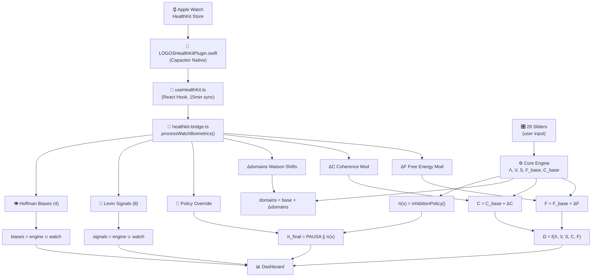

# LOOP BIOMÉTRICO CERRADO — LOGOS × HealthKit × Apple Watch

> **Documento:** SRS-BIO-001  
> **Estándar:** IEEE 830 / ISO/IEC/IEEE 42010  
> **Versión:** 3.2.0  
> **Autor:** Dr. José Manuel Cadena Ortiz de Montellano  
> **Framework:** Cadena Strategic Systems  
> **Fecha:** 2026-02-09

---

## Índice

1. [Visión General](#1-visión-general)
2. [Flujo de Datos Completo](#2-flujo-de-datos-completo)
3. [Módulos del Pipeline](#3-módulos-del-pipeline)
4. [Moduladores Biométricos](#4-moduladores-biométricos)
5. [Integración con el Motor Core](#5-integración-con-el-motor-core)
6. [Policy Override (PAUSA Biométrica)](#6-policy-override-pausa-biométrica)
7. [Señales Levin Biométricas](#7-señales-levin-biométricas)
8. [Sesgos Hoffman Biométricos](#8-sesgos-hoffman-biométricos)
9. [Diagrama de Arquitectura](#9-diagrama-de-arquitectura)
10. [Tabla de Tipos de Datos HealthKit](#10-tabla-de-tipos-de-datos-healthkit)

---

## 1. Visión General

El Loop Biométrico Cerrado es la integración completa entre los datos biométricos del Apple Watch (vía HealthKit) y el motor de cómputo LOGOS. A diferencia de un enfoque de "solo mostrar", los datos biométricos **modulan activamente** las métricas core del sistema:

- **F (Free Energy)** — SpO₂ baja y HR Recovery pobre aumentan F
- **C (Coherence)** — Ruido ambiental >80dB reduce C
- **Domains** — VO₂ Max, temperatura, pasos, sueño profundo shift dominios Physical/Emotional
- **π(x) Verdict** — AFib, SpO₂ <90%, taquicardia >120bpm fuerzan PAUSA
- **Levin Signals** — 8 señales biométricas adicionales del Watch
- **Hoffman Biases** — 4 sesgos de discrepancia subjetivo vs objetivo

**Principio arquitectónico:** Los biométricos aportan datos *objetivos* que corrigen o modulan la autoevaluación *subjetiva* del usuario en los 28 sliders.

---

## 2. Flujo de Datos Completo

```
┌─────────────────────────────────────────────────────────────────┐
│                    APPLE WATCH (watchOS)                         │
│  HealthKit Store: HR, HRV, SpO₂, Sleep, Steps, VO₂, ECG, ...  │
└──────────────────────────┬──────────────────────────────────────┘
                           │ WatchConnectivity / HealthKit API
                           ▼
┌─────────────────────────────────────────────────────────────────┐
│              LOGOSHealthKitPlugin.swift (Capacitor)              │
│  readAllBiometrics() → WatchBiometrics JSON (~35 data types)    │
└──────────────────────────┬──────────────────────────────────────┘
                           │ Capacitor bridge
                           ▼
┌─────────────────────────────────────────────────────────────────┐
│                useHealthKit.ts (React Hook)                      │
│  - Authorization check                                          │
│  - Periodic sync (every 15 min)                                 │
│  - Cache in localStorage                                        │
│  - mapBiometricsToDimensions() → autoPopulatedDimensions        │
│  - Exposes: biometrics, ecg, autoPopulatedDimensions            │
└──────────────────────────┬──────────────────────────────────────┘
                           │
                           ▼
┌─────────────────────────────────────────────────────────────────┐
│            healthkit-bridge.ts (Core Processing)                 │
│  processWatchBiometrics(biometrics, ecg, state) → WatchEngine   │
│                                                                  │
│  Returns:                                                        │
│  ├── freeEnergyMod   { totalMod, components[] }                 │
│  ├── coherenceMod    { totalMod, components[] }                 │
│  ├── watsonShifts    [{ domain, shift, reason }]                │
│  ├── policyOverride  { active, reason, source }                 │
│  ├── levinSignals    [{ label, severity, description, source }] │
│  └── hoffmanBiases   [{ label, magnitude, subjectiveValue,     │
│                         objectiveValue, description }]           │
└──────────────────────────┬──────────────────────────────────────┘
                           │
                           ▼
┌─────────────────────────────────────────────────────────────────┐
│              LogosHumano.jsx (Integration Point)                 │
│                                                                  │
│  watchEngine = useMemo(() =>                                     │
│    processWatchBiometrics(biometrics, ecg, state))               │
│                                                                  │
│  F = base_F + watchEngine.freeEnergyMod.totalMod                │
│  C = base_C + watchEngine.coherenceMod.totalMod                 │
│  domains[k] += watchEngine.watsonShifts[k].shift                │
│  π(x) = PAUSA if watchEngine.policyOverride.active              │
│  signals = [...engineSignals, ...watchEngine.levinSignals]      │
│  biases = [...engineBiases, ...watchEngine.hoffmanBiases]       │
│                                                                  │
│  Ω recalculated with modulated F, C → full dashboard reflects   │
│  real biometric data                                             │
└─────────────────────────────────────────────────────────────────┘
```

---

## 3. Módulos del Pipeline

### 3.1 LOGOSHealthKitPlugin.swift

**Archivo:** `ios/App/App/LOGOSHealthKitPlugin.swift`  
**Tipo:** Plugin nativo Capacitor (Swift)  
**Responsabilidad:** Interfaz directa con HealthKit Store

**Tipos de datos leídos (~35):**

| Categoría | Tipos HealthKit |
|-----------|----------------|
| **Cardíacos** | heartRate, heartRateVariabilitySDNN, restingHeartRate, walkingHeartRateAverage |
| **Respiratorios** | oxygenSaturation, respiratoryRate |
| **Actividad** | stepCount, distanceWalkingRunning, activeEnergyBurned, appleExerciseTime, vo2Max |
| **Sueño** | sleepAnalysis (InBed, Asleep, REM, Core, Deep, Awake) |
| **Composición** | bodyMass, bodyMassIndex, bodyFatPercentage, leanBodyMass |
| **Ambiente** | environmentalAudioExposure |
| **ECG** | electrocardiogramType (sinusRhythm, atrialFibrillation, inconclusive) |
| **Estado Mental** | stateOfMind (valence, labels, associations) |
| **Otros** | bodyTemperature, bloodPressureSystolic, bloodPressureDiastolic, bloodGlucose |

### 3.2 useHealthKit.ts

**Archivo:** `src/hooks/useHealthKit.ts`  
**Tipo:** React Hook  
**Responsabilidad:** Orquestación de sincronización y mapeo a dimensiones

**Funciones clave:**

| Función | Descripción |
|---------|-------------|
| `checkAvailability()` | Verifica si HealthKit está disponible en el dispositivo |
| `requestAuthorization()` | Solicita permisos al usuario |
| `syncBiometrics()` | Llama `readAllBiometrics()` y cachea resultado |
| `mapBiometricsToDimensions()` | Traduce biométricos a dimensiones LOGOS (0-1 scale) |

**Mapeo biométricos → dimensiones:**

| Biométrico | Dimensión LOGOS | Fórmula |
|-----------|----------------|---------|
| sleepHours | `sleep` | clamp(hours / 8, 0, 1) |
| exerciseMinutes | `exercise` | clamp(minutes / 60, 0, 1) |
| restingHeartRate | `energy` | 1 - clamp((rhr - 50) / 40, 0, 1) |
| heartRateVariability | `peace` | clamp(hrv / 100, 0, 1) |
| mindfulMinutes | `meditation` | clamp(minutes / 30, 0, 1) |

### 3.3 healthkit-bridge.ts

**Archivo:** `src/core/healthkit-bridge.ts`  
**Tipo:** Módulo core puro (sin deps React)  
**Responsabilidad:** Procesamiento de biométricos crudos → moduladores LOGOS

Función principal: `processWatchBiometrics(biometrics, ecg, state) → WatchEngineResult`

---

## 4. Moduladores Biométricos

### 4.1 Free Energy Modulator (freeEnergyMod)

El modulador de Free Energy **aumenta F** cuando los biométricos indican estrés fisiológico:

| Componente | Condición | Efecto en F | Rango |
|-----------|-----------|-------------|-------|
| SpO₂ baja | SpO₂ < 95% | +0.05 a +0.15 | [0, 0.15] |
| HR Recovery pobre | HRR < 12 bpm | +0.03 a +0.10 | [0, 0.10] |
| HRV baja | HRV < 30ms | +0.02 a +0.08 | [0, 0.08] |
| RHR elevada | RHR > 80 bpm | +0.02 a +0.06 | [0, 0.06] |

**Aplicación en LogosHumano.jsx:**
```javascript
const F = Math.max(0, Math.min(1.5, base_F + watchEngine.freeEnergyMod.totalMod));
```

### 4.2 Coherence Modulator (coherenceMod)

El modulador de Coherencia **reduce C** cuando hay factores de dispersión:

| Componente | Condición | Efecto en C | Rango |
|-----------|-----------|-------------|-------|
| Ruido ambiental | >80 dB | -0.03 a -0.10 | [-0.10, 0] |
| Sueño fragmentado | >3 awakenings | -0.02 a -0.08 | [-0.08, 0] |
| HRV baja | HRV < 30ms | -0.02 a -0.05 | [-0.05, 0] |
| Temp corporal anormal | <36°C o >37.5°C | -0.02 a -0.05 | [-0.05, 0] |

**Aplicación en LogosHumano.jsx:**
```javascript
const C = Math.max(0, Math.min(1, base_C + watchEngine.coherenceMod.totalMod));
```

### 4.3 Watson Landscape Shifts (watsonShifts)

Los shifts de Watson **ajustan dominios** basados en datos objetivos:

| Biométrico | Dominio Afectado | Dirección | Ejemplo |
|-----------|-----------------|-----------|---------|
| VO₂ Max alto | Physical | +shift | VO₂ >45 → physical +0.05 |
| Temp corporal baja | Physical | -shift | <36°C → physical -0.04 |
| RHR elevada | Emotional | -shift | >85 bpm → emotional -0.03 |
| Steps alto | Physical | +shift | >10k → physical +0.04 |
| Deep sleep alto | Physical | +shift | >90 min → physical +0.05 |
| REM bajo | Emotional | -shift | <60 min → emotional -0.03 |

**Aplicación en LogosHumano.jsx:**
```javascript
const domains = { ...base_domains };
for (const ws of watchEngine.watsonShifts) {
  const key = ws.domain.toLowerCase();
  if (key in domains) {
    domains[key] = Math.max(0, Math.min(1, domains[key] + ws.shift));
  }
}
```

---

## 5. Integración con el Motor Core

### 5.1 Orden de Ejecución en LogosHumano.jsx

```
1. state (28 sliders)
2. Λ = computeLogosAlignment(state)
3. V = computeViability(state, Λ)
4. S = computeEntropy(state, Λ)
5. watchEngine = processWatchBiometrics(biometrics, ecg, state)  ← BIOMETRIC
6. F = computeFreeEnergy(state, Λ) + watchEngine.freeEnergyMod   ← MODULATED
7. C = computeCoherence(state, Λ) + watchEngine.coherenceMod     ← MODULATED
8. domains = coherenceResult.domains + watchEngine.watsonShifts   ← SHIFTED
9. Ω = computeOmega(Λ, V, S, C, F)                              ← USES MODULATED C,F
10. π(x) = watchEngine.policyOverride || inhibitionPolicy(...)    ← OVERRIDABLE
11. signals = [...engineSignals, ...watchEngine.levinSignals]     ← MERGED
12. biases = [...engineBiases, ...watchEngine.hoffmanBiases]      ← MERGED
```

### 5.2 Principio de Modulación

Los biométricos **no reemplazan** las métricas core — las **modulan**:

- `F_final = F_base + ΔF_biometric` (aditivo, clamped [0, 1.5])
- `C_final = C_base + ΔC_biometric` (aditivo, clamped [0, 1])
- `domain_final = domain_base + Δdomain_biometric` (aditivo, clamped [0, 1])

Esto preserva la integridad del modelo matemático mientras incorpora datos objetivos.

---

## 6. Policy Override (PAUSA Biométrica)

Cuando se detectan señales biométricas críticas, el sistema **fuerza el veredicto a PAUSA** independientemente de los valores de Λ, V, S, C:

### Condiciones de Activación

| Señal | Umbral | Severidad | Razón |
|-------|--------|-----------|-------|
| **AFib detectada** | ECG = atrialFibrillation | Crítica | "Fibrilación auricular detectada — consulta médica inmediata" |
| **SpO₂ crítica** | SpO₂ < 90% | Crítica | "Saturación de oxígeno peligrosamente baja" |
| **Taquicardia** | HR > 120 bpm en reposo | Alta | "Frecuencia cardíaca elevada en reposo" |

### Implementación

```javascript
const pi = useMemo(() => {
  if (watchEngine?.policyOverride?.active) {
    return {
      ...piRaw,
      verdict: 'PAUSA',
      reason: watchEngine.policyOverride.reason,
      inhibited: true,
    };
  }
  return { ...piRaw, /* normal translation */ };
}, [piRaw, t, watchEngine]);
```

---

## 7. Señales Levin Biométricas

8 señales adicionales del Watch se integran con las 9 señales software del engine:

| # | Señal | Source | Descripción |
|---|-------|--------|-------------|
| 1 | AFib Detection | ECG | Fibrilación auricular detectada por el sensor ECG |
| 2 | SpO₂ Alert | SpO₂ | Saturación de oxígeno por debajo del umbral seguro |
| 3 | Temperature Anomaly | Temp | Temperatura corporal fuera de rango normal |
| 4 | Gait Asymmetry | Motion | Asimetría en la marcha detectada por acelerómetro |
| 5 | HR Recovery Poor | HR | Recuperación cardíaca post-ejercicio inadecuada |
| 6 | Noise Exposure | Audio | Exposición prolongada a niveles de ruido dañinos |
| 7 | REM Deficit | Sleep | Tiempo insuficiente en fase REM |
| 8 | Deep Sleep Deficit | Sleep | Tiempo insuficiente en sueño profundo |

---

## 8. Sesgos Hoffman Biométricos

4 sesgos que revelan discrepancias entre percepción subjetiva y realidad objetiva:

| # | Sesgo | Descripción | Detección |
|---|-------|-------------|-----------|
| 1 | **Ilusión de Sueño** | Usuario reporta buen sueño pero HealthKit muestra sueño fragmentado | sleep_slider > 0.7 && actual_deep_sleep < 60 min |
| 2 | **Sobreestimación Fitness** | Usuario reporta alto ejercicio pero VO₂ Max es bajo | exercise_slider > 0.7 && vo2Max < 35 |
| 3 | **Sobreestimación Energía** | Usuario reporta alta energía pero RHR está elevada | energy_slider > 0.7 && rhr > 80 |
| 4 | **Incongruencia de Paz** | Usuario reporta paz interior pero HRV es muy baja | peace_slider > 0.7 && hrv < 25ms |

**Formato de salida:**
```javascript
{
  type: "Ilusión de Sueño",
  severity: 0.65,
  desc: "Tu percepción de sueño (70%) difiere de los datos objetivos",
  correction: "Subjetivo: 70% vs Objetivo: 42%",
  isWatch: true,
}
```

---

## 9. Diagrama de Arquitectura



---

## 10. Tabla de Tipos de Datos HealthKit

### WatchBiometrics Interface

```typescript
interface WatchBiometrics {
  heartRate?: number;              // bpm (last reading)
  heartRateVariability?: number;   // ms (SDNN)
  restingHeartRate?: number;       // bpm
  walkingHeartRateAverage?: number; // bpm
  oxygenSaturation?: number;      // 0-100 (%)
  respiratoryRate?: number;       // breaths/min
  stepCount?: number;             // daily total
  distanceWalkingRunning?: number; // meters
  activeEnergyBurned?: number;    // kcal
  exerciseMinutes?: number;       // minutes
  vo2Max?: number;                // mL/kg/min
  sleepHours?: number;            // total hours
  sleepREM?: number;              // minutes
  sleepDeep?: number;             // minutes
  sleepCore?: number;             // minutes
  sleepAwakenings?: number;       // count
  bodyMass?: number;              // kg
  bodyMassIndex?: number;         // kg/m²
  bodyFatPercentage?: number;     // 0-100
  bodyTemperature?: number;       // °C
  environmentalAudioExposure?: number; // dB
  bloodPressureSystolic?: number;  // mmHg
  bloodPressureDiastolic?: number; // mmHg
  bloodGlucose?: number;          // mg/dL
  mindfulMinutes?: number;        // minutes
}
```

### WatchEngineResult Interface

```typescript
interface WatchEngineResult {
  freeEnergyMod: {
    totalMod: number;             // ΔF to add to base F
    components: Array<{ source: string; mod: number; reason: string }>;
  };
  coherenceMod: {
    totalMod: number;             // ΔC to add to base C
    components: Array<{ source: string; mod: number; reason: string }>;
  };
  watsonShifts: Array<{
    domain: string;               // 'Physical' | 'Emotional' | ...
    shift: number;                // Δ to add to domain value
    reason: string;
  }>;
  policyOverride: {
    active: boolean;
    reason: string;
    source: string;               // 'ecg' | 'spo2' | 'hr'
  };
  levinSignals: Array<{
    label: string;
    severity: number;             // 0-1
    description: string;
    source: string;
  }>;
  hoffmanBiases: Array<{
    label: string;
    magnitude: number;            // 0-1
    subjectiveValue: number;      // what user reported (0-1)
    objectiveValue: number;       // what biometrics show (0-1)
    description: string;
  }>;
}
```

---

## Referencias Cruzadas

- [HEALTHKIT_BRIDGE.md](./HEALTHKIT_BRIDGE.md) — Detalle del procesamiento biométrico
- [APPLE_WATCH_ARCHITECTURE.md](./APPLE_WATCH_ARCHITECTURE.md) — Arquitectura del Watch companion
- [ARCHITECTURE.md](./ARCHITECTURE.md) — Arquitectura general del sistema
- [MATHEMATICAL_SPEC.md](./MATHEMATICAL_SPEC.md) — Ecuaciones core moduladas
