# DIAGRAMAS — LOGOS

> **Documento:** SRS-DIAG-001  
> **Estándar:** IEEE 830 / ISO/IEC/IEEE 42010  
> **Versión:** 3.3.0  
> **Autor:** Dr. José Manuel Cadena Ortiz de Montellano  
> **Framework:** Cadena Strategic Systems  
> **Fecha:** 2026-02-09

---

## Índice

1. [Diagrama de Flujo del Cálculo de Métricas](#1-diagrama-de-flujo-del-cálculo-de-métricas)
2. [Diagrama de Secuencia del Monte Carlo](#2-diagrama-de-secuencia-del-monte-carlo)
3. [Diagrama de Estados de π(x)](#3-diagrama-de-estados-de-πx)
4. [Diagrama de Clases/Componentes](#4-diagrama-de-clasescomponentes)
5. [Diagrama de Dependencias de Módulos](#5-diagrama-de-dependencias-de-módulos)
6. [Diagrama de Flujo de Autenticación](#6-diagrama-de-flujo-de-autenticación)
7. [Diagrama de Atractores Duales](#7-diagrama-de-atractores-duales)
8. [Diagrama IFC ↔ LOGOS Bridge (v3.3.0)](#8-diagrama-ifc--logos-bridge-v330)
9. [Diagrama de Interpretación AI (v3.3.0)](#9-diagrama-de-interpretación-ai-v330)

---

## 1. Diagrama de Flujo del Cálculo de Métricas

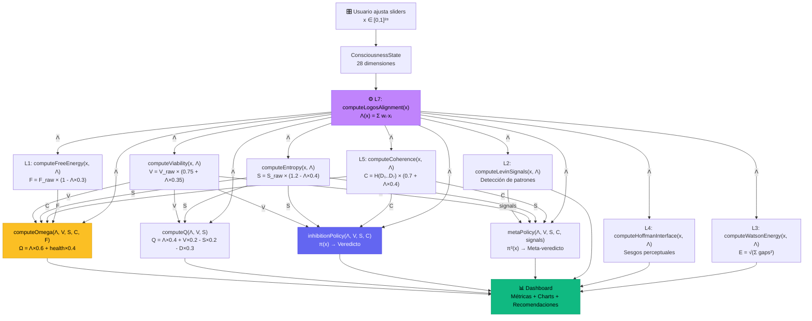

---

## 2. Diagrama de Secuencia del Monte Carlo

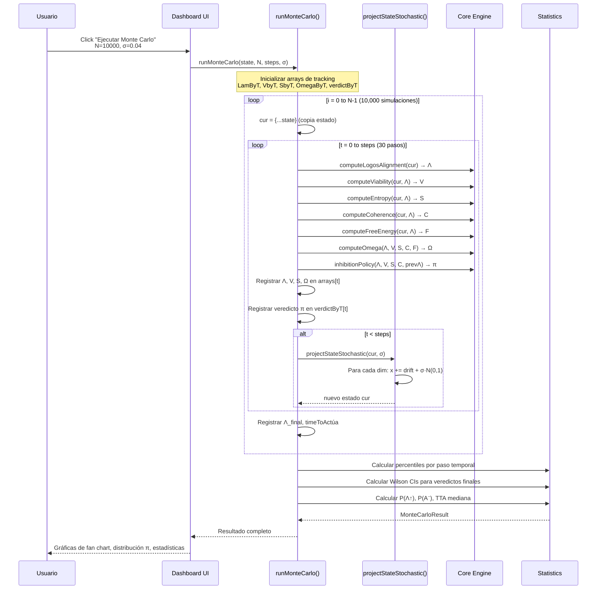

---

## 3. Diagrama de Estados de π(x)

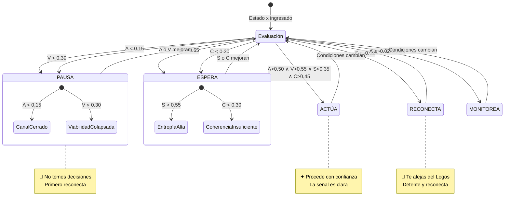

### Meta-Política π²(x)

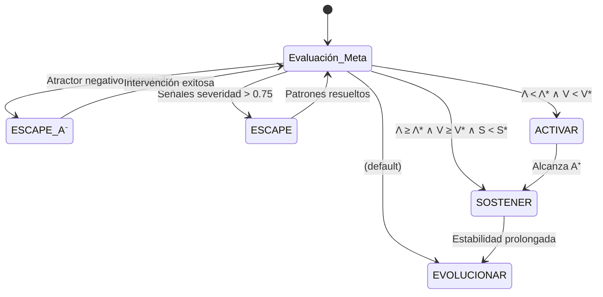

---

## 4. Diagrama de Clases/Componentes

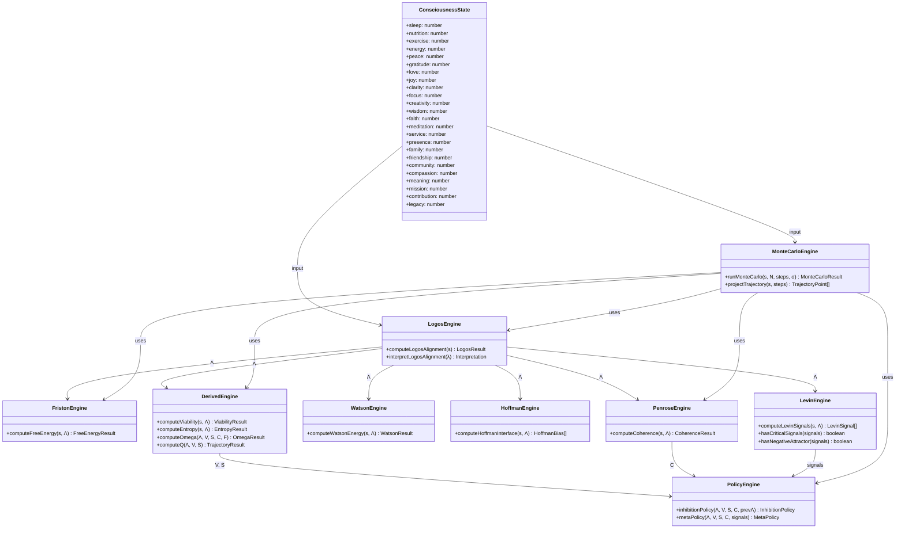

---

## 5. Diagrama de Dependencias de Módulos

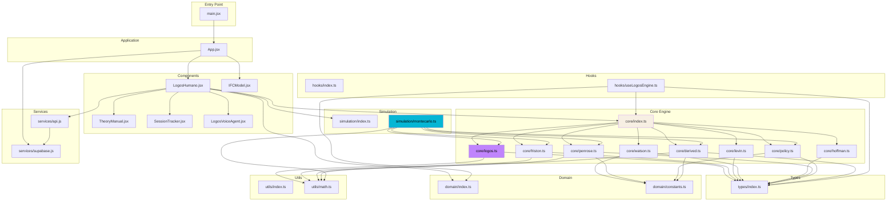

---

## 6. Diagrama de Flujo de Autenticación (Supabase)

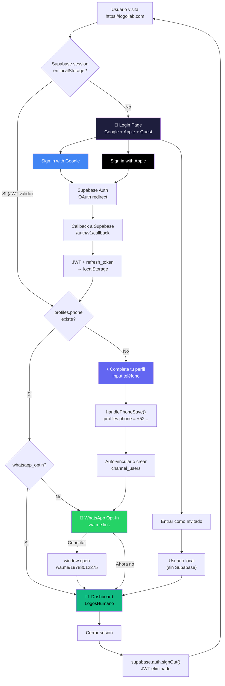

---

## 6b. Diagrama de Identidad Cross-Channel

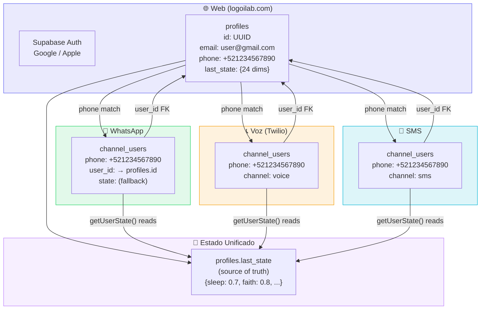

---

## 7. Diagrama de Atractores Duales

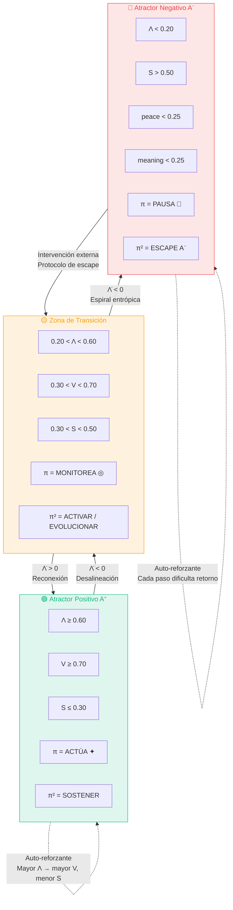

---

## 8. Diagrama IFC ↔ LOGOS Bridge (v3.3.0)

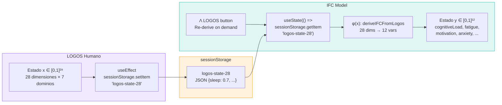

---

## 9. Diagrama de Interpretación AI (v3.3.0)

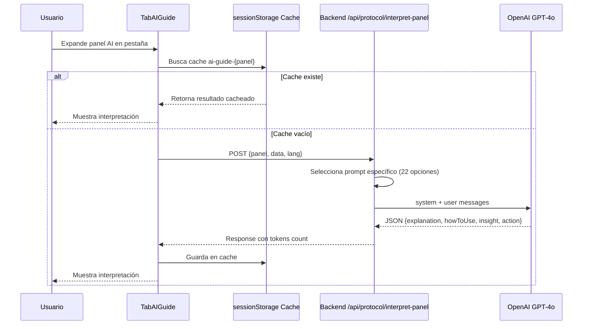

**22 paneles disponibles:**
- **LOGOS (13):** coherence, landscape, estado, motor, decision, guia, trayectoria, montecarlo, alimento, seguimiento, biometrics, teoria, ifc
- **IFC (9):** ifc-dashboard, ifc-state, ifc-controls, ifc-simulator, ifc-montecarlo, ifc-attractor, ifc-policy, ifc-metapolicy, ifc-theory

---

## Referencias Cruzadas

- [Arquitectura del Sistema](./ARCHITECTURE.md)
- [Especificación Matemática](./MATHEMATICAL_SPEC.md)
- [Componentes React](./COMPONENTS.md)
- [API Reference](./API_REFERENCE.md)
